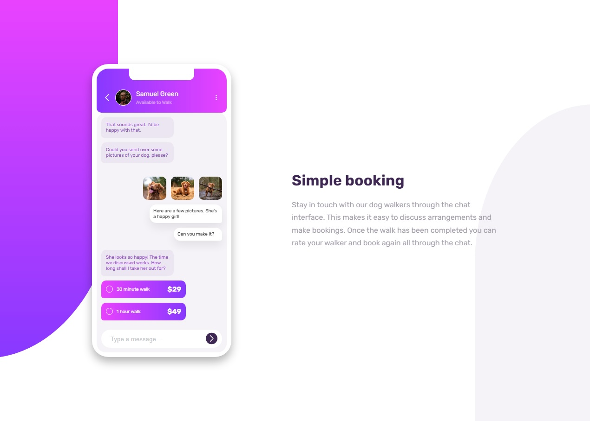

# Frontend Mentor - Chat app CSS illustration solution

This is a solution to the [Chat app CSS illustration challenge on Frontend Mentor](https://www.frontendmentor.io/challenges/chat-app-css-illustration-O5auMkFqY). Frontend Mentor challenges help you improve your coding skills by building realistic projects.

## Table of contents

- [Overview](#overview)
  - [The challenge](#the-challenge)
  - [Screenshot](#screenshot)
  - [Links](#links)
- [My process](#my-process)

  - [Built with](#built-with)
  - [What I learned](#what-i-learned)

- [Author](#author)

## Overview

### The challenge

Users should be able to:

- View the optimal layout for the component depending on their device's screen size
- **Bonus**: See the chat interface animate on the initial load

### Screenshot

### Links

- Solution URL: https://www.frontendmentor.io/solutions/chat-app-css-illustration-bwdP5lEaZl
- Live Site URL: https://mks-chat-app-css-illustration.netlify.app/

## My process

### Built with

- HTML
- CSS
- Flexbox
- Sass

### What I learned

- design complex design with css
- use flex-box
- use organized sass files

## Author

- Mohamed Khaled Samir
