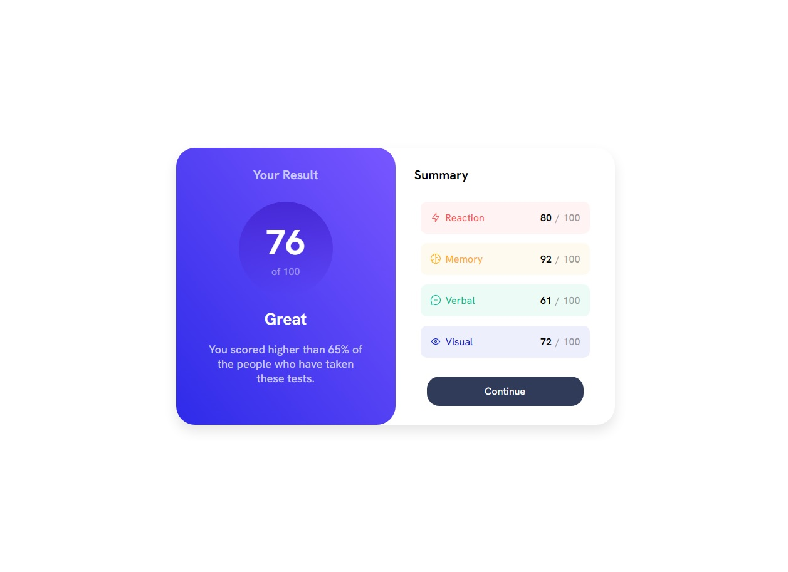

# Frontend Mentor - Results summary component solution

## Table of contents

- [Overview](#overview)
  - [The challenge](#the-challenge)
  - [Screenshot](#screenshot)
  - [Links](#links)
- [My process](#my-process)
  - [Built with](#built-with)
  - [What I learned](#what-i-learned)
- [Author](#author)

## Overview

### The challenge

Users should be able to:

- View the optimal layout for the interface depending on their device's screen size
- See hover and focus states for all interactive elements on the page

### Screenshot

### Links

- Solution URL: https://www.frontendmentor.io/solutions/results-summary-component-B0jNqY-xjt
- Live Site URL: https://mks-short-projects.netlify.app/css/design/results-summary-component/

## My process

### Built with

- HTML
- CSS

### What I learned

- use flex-box
- use media queries

## Author

- Mohamed Khaled Samir
